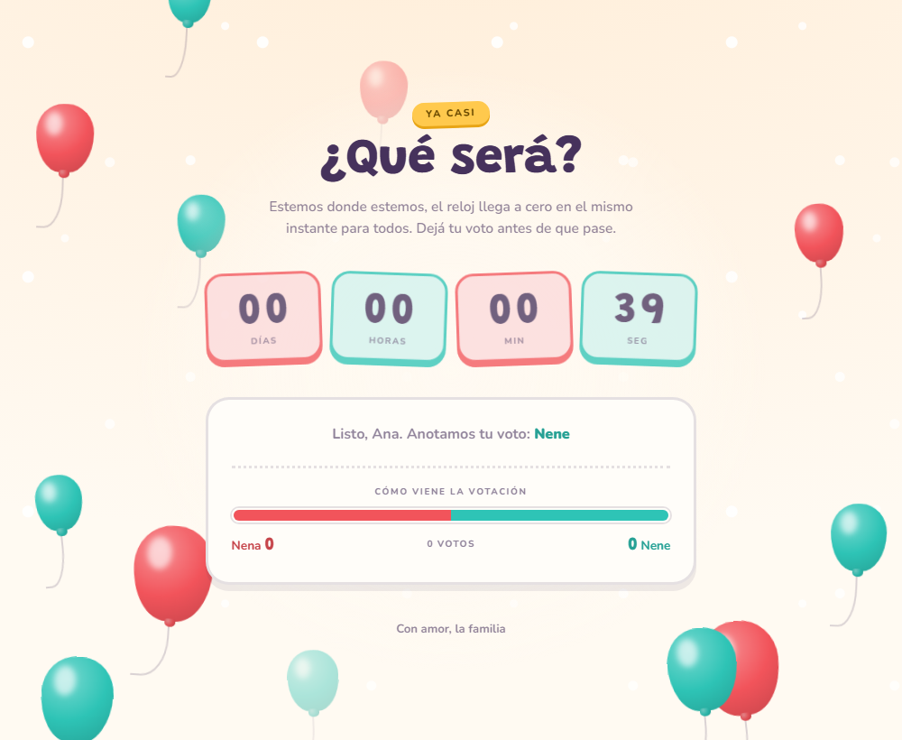
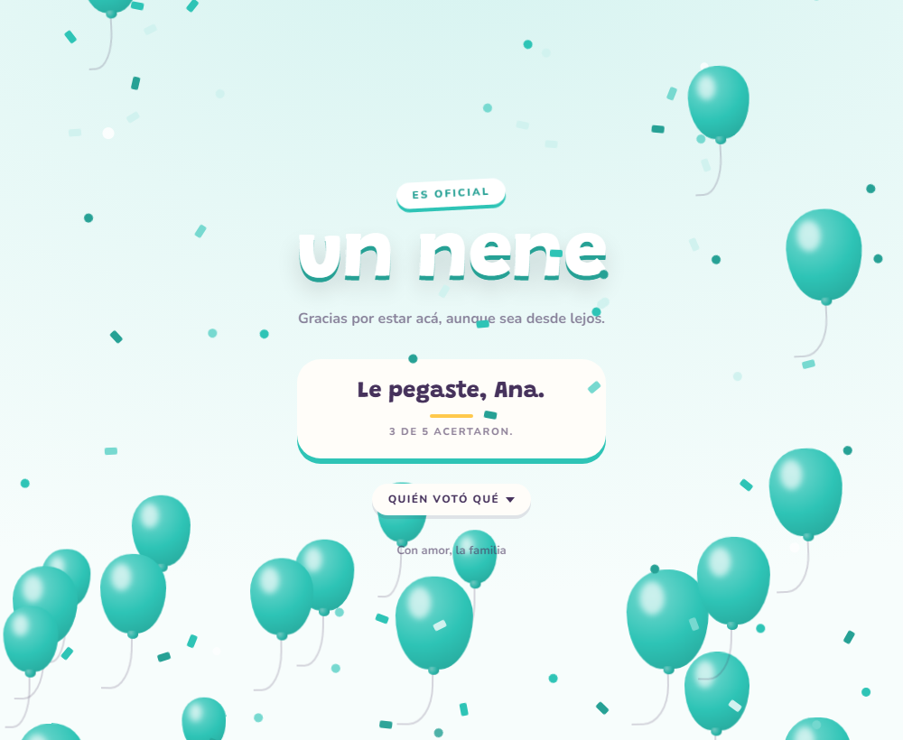
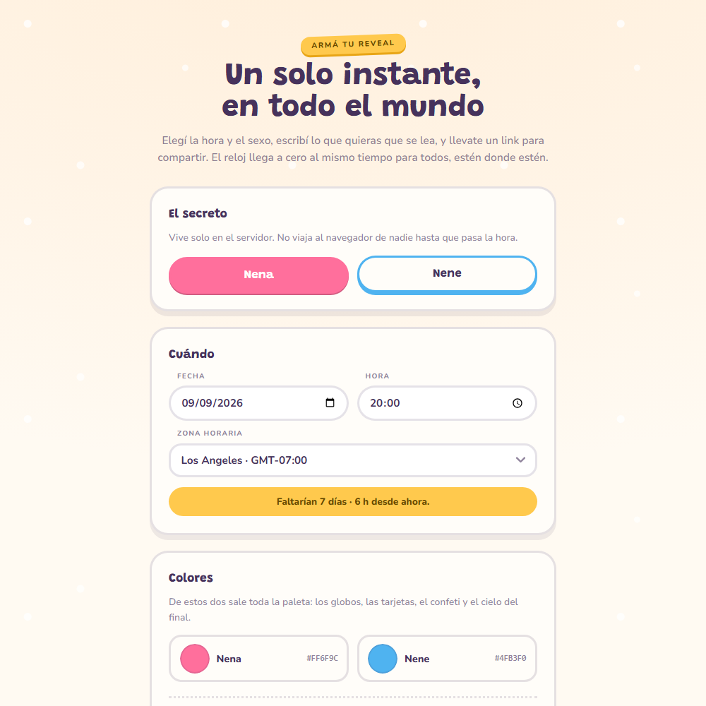

# 🎈 Gender Reveal


**Fill in a form. Get a link. Send it to everyone you know.**

When the clock hits zero, it hits zero for all of them at the same time. Buenos
Aires, Madrid, your cousin on a plane over the Atlantic. Only then does the page
say whether it's a girl or a boy. Guests guess while the clock runs, and at zero
each one finds out whether they were right, and how many other people were.

Run as many countdowns as you want. Each one gets its own link and minds its own
business. The whole thing fits on Vercel's free plan.

## 🎬 The whole app, in two pictures

Before, everybody guesses. Pink and blue in equal number, on purpose: nothing on
that screen leans either way, because the screen doesn't know either.

The running tally stays hidden until you have voted, so nobody gets nudged by
whichever way the room is already leaning. Who guessed what stays hidden until
the hour, and then folds open under the announcement for anyone curious enough
to click.

After, half the balloons pop where they float and the confetti comes down in
whichever colour won.

| ⏳ While the clock runs | 🎉 The moment it stops |
| --- | --- |
|  |  |

## 🕵️ The two ways this could ruin your night

It's a silly app. These two things are not silly, so they got all the attention.

### 😶 Someone finds out early

The gender lives in a database column and nowhere else. So does every word of
the reveal copy. Before the hour, `/api/reveals/[hash]/state` returns a
countdown and some vote counts, and that's it. No gender, no wording, no sky
colour. Open DevTools and there's nothing to find.

When the moment does pass, the server picks the winning phrase and sends only
that one. The browser never holds both options, because holding both means
holding the answer.

Votes stop being accepted at the hour too. Each countdown closes on **its own**
instant, so two can be open at once and shut hours apart.

### 🕰️ The clock is wrong

Not your clock. Theirs.

The creator picks a wall-clock time and a timezone, and the server collapses it
into one moment in history. It does that by asking the zone how it reads a
candidate instant and correcting, twice, so a correction that trips over a DST
boundary still lands. There's no table of offsets in this codebase and no DST
arithmetic. Good, because that's where these things go wrong.

Then there's the guest whose laptop is forty minutes fast. Every response
carries `serverNow`, each browser measures its own drift against it, and the
countdown runs on the corrected time. Set your clock three hours ahead and the
page politely ignores you.

The whole feature is called sync. You cannot wash dishes in it. I checked.

## 🎨 Colours

Pick two. The server derives light, deep, pale and three sky tints from each,
and the page wears all eight. Balloons, countdown cards, the tally bar, the
confetti, the wash of colour at the end.

Coral and teal, if pink and blue aren't your thing. Purple and green if you're
feeling brave. Nobody's stopping you.

| 🪸 Your two colours | 🌊 all the way through |
| --- | --- |
|  |  |

Two notes for whoever touches this next.

Those shades are derived in JavaScript on the server, not with `color-mix` in
CSS, and that's deliberate. A CSS custom property substitutes its `var()`
references at the element where it's *declared*. Derive `--girl-deep` from
`--girl` up in `:root`, override `--girl` further down the tree, and
`--girl-deep` keeps the old value and you spend an afternoon confused. Ask me
how I know. Deriving on the server also means older Safari, which has no
`color-mix`, gets the same page as everyone else.

And colours are validated as strict `#rrggbb` before anything is stored,
because they're written into a `style` attribute. A colour field that accepts
`#fff;background:url(//somewhere-else)` is not a colour field, it's a CSS
injection with a nice UI.

## 📏 The rules

| Rule | Value | What happens |
| --- | --- | --- |
| ⏱️ Longest countdown | 45 days | Rejected at creation, `horizon_exceeded` |
| 🗑️ Kept after the reveal | 30 days | `expires_at`, then purged |
| ⏮️ Reveal in the past | Nope | `time_in_past` |

Forty-five days is already a long time to keep a secret from your mother.

Thirty days after, because by then everybody has moved on. Including the
database. Retention runs twice over: opportunistically whenever somebody creates
a countdown, and by a daily Vercel Cron on `/api/cron/purge`. An expired
countdown returns 404 from the instant it expires, whether or not the sweep has
run. Unreachable immediately, deleted shortly after.

## 🛠️ Getting it running

```bash
npm install
npm run dev
```

`http://localhost:3000` is the form. Fill it in, get a link, open it. No
account, no network, no environment variables. Everything lands in `local.db`,
which is gitignored.



Every text on the site is a field in there, folded into two collapsed sections
so the form doesn't open like a tax return. All of them are pre-filled, so you
can ship it without reading a single one. Which is exactly what you'll do.

### ✏️ Changing what the form starts with

`content/defaults.json` holds the two colours and every line of copy the app
will ever show. Edit it and the form starts from your wording. Nothing is
hardcoded in a component.

Its two sections are the security boundary, not just organisation:

- 👀 `countdown` ships to every browser immediately.
- 🔒 `reveal` is **held on the server until the hour**. Write whatever you want
  in there. Nobody can peek.

`{name}`, `{correct}` and `{total}` get filled in at render time. Every field
has a length limit in `lib/messages.ts`, and that table doubles as the
allow-list: anything submitted that isn't named there gets dropped rather than
stored.

## ☁️ Putting it on the internet

**1. A database that remembers things.**

Vercel's filesystem has commitment issues. Serverless functions get an
ephemeral, read-only disk, `/tmp` is per-instance and wiped between
invocations, and votes written there would either vanish or disagree depending
on which instance answered. That is a fun bug to discover on the night.

Turso is the same SQLite, hosted, reachable over HTTP. Free plan is 5 GB, 500M
row reads and 10M writes a month, which is roughly a million times what a party
needs.

```bash
turso db create gender-reveal
turso db show gender-reveal --url          # → TURSO_DATABASE_URL
turso db tokens create gender-reveal       # → TURSO_AUTH_TOKEN
```

The schema builds itself on the first request. No migration step.

**2. Import the repo on Vercel** and add these under *Settings → Environment
Variables*:

| Name | Required | Value |
| --- | --- | --- |
| `TURSO_DATABASE_URL` | ✅ | from step 1 |
| `TURSO_AUTH_TOKEN` | ✅ | from step 1 |
| `CRON_SECRET` | for the daily purge | any long random string |

`vercel.json` registers the cron. Vercel sends `CRON_SECRET` as a bearer token
and the endpoint refuses anything else.

**3. Send the link.** Guests need no account and no app. Reveal pages are
`noindex`, so Google won't find out before grandma does.

## ✅ Before the day

- [ ] Made the countdown on the deployed site, not on localhost
- [ ] Opened the link and read it top to bottom
- [ ] Set your laptop clock two hours off and confirmed the countdown ignored
      you, which is the drift correction earning its keep
- [ ] Left a test vote, then cleared `localStorage` before sharing anything
- [ ] **Saved the link somewhere that isn't this browser**

That last one is not decoration. The form keeps a list of what you made in
`localStorage` and shows it under the form, but there's no account and no
recovery. Clear your browser data and that countdown is gone to you, still
happily ticking for everyone you sent it to.

Do a dress rehearsal. Make a throwaway countdown two minutes out and watch it
fire. It costs nothing and it's the only way to see the real thing before the
real thing.

## 🙈 Honest caveats

**Turso has never actually run.** Every test so far went through the local
`node:sqlite` adapter. Same port, same SQL, but the production store has not
executed once. Your two-minute dress rehearsal on a preview deploy is its first
real outing, which is the main reason to do it.

**No rate limiting.** Anyone who reaches the site can create a countdown.
Payload size and every field are capped, which is the right amount of armour
for something this size. If the URL travels further than you meant it to,
that's the thing to add.

**Polling, not websockets.** Every open tab asks for the state every 8 seconds,
and every 1.2 seconds in the last stretch. Fifty guests over two hours is about
45k function calls against a 1M monthly allowance. Vercel's free plan has
nowhere to hold a socket open and a family-sized guest list doesn't need one.

## 🎈 Why did the balloon go near the needle?

It wanted to be popular.

Speaking of which: the balloons render *above* the countdown/reveal swap, not
inside either screen. Put them inside and React unmounts them at the switch,
they restart, and the moment reads as a cut. Outside, zero is one continuous
event. The losing colour bursts where it floats in a staggered ripple, the
winning colour carries on and is joined by more, the sky takes its tint, and
the confetti falls.

The trick that makes "bursts where it floats" work is `animation-play-state:
paused` on the balloon wrapper. It freezes the rise without touching the burst
ring on its `::after` or the pop animation on its child. Balloon stops mid-air,
then goes.

## 🗂️ Where things live

```
app/
  page.tsx                        the form
  r/[hash]/page.tsx               a countdown. Hands down its palette, never the answer
  api/reveals/route.ts            POST: validate, derive, store, hand back a link
  api/reveals/[hash]/state        the single source of truth. Opens the envelope on time
  api/reveals/[hash]/vote         takes guesses, closes at that countdown's hour
  api/cron/purge                  the daily sweep
components/
  Configurator.tsx                the form
  Balloons.tsx                    lives above the swap, which is the whole point
  Countdown, VotePanel, Reveal, Confetti
lib/
  reveals.ts                      validation, hashes, retention, the withheld copy
  palette.ts                      two colours become a whole theme
  time.ts                         wall clock plus IANA zone becomes one instant
  messages.ts                     the copy that's safe to ship, and every field limit
  useRevealState.ts               drift correction and polling
  myVote.ts                       the guest's own guess, in localStorage, one key per countdown
  store/                          RevealStore port, Turso and local-file adapters
content/
  defaults.json                   what the form starts from
docs/img/                         the screenshots above, taken from the running app
```

Next.js 15 on the App Router. About 107 kB of JavaScript on first load, most of
which is React. The balloons and the confetti are CSS transforms, not a library.

There are two hard problems in a gender reveal app: keeping a secret, and
timezones. Everything else was the fun part.
